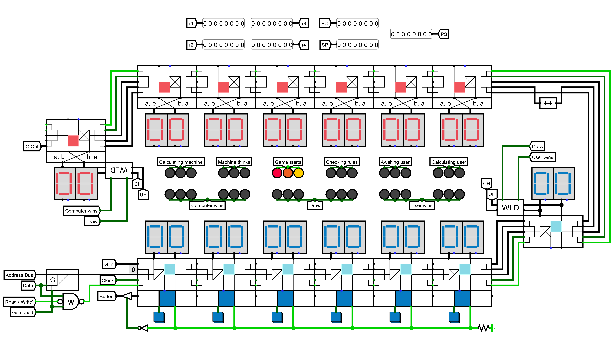

# mancala
Kalah (6, 4) game for Logisim, built on the CdM-8 processor.

---
| |
|:-----------------------------------------------:|
|                 Mancala Gamepad                 |

---

Requires:
- **PowerShell** and **Python** to build images from the source code
- **Logisim** to run game itself - you need to open `main.circ` file

Special thanks to [**Nikolay Repin**](https://github.com/Intelix8996) for his [**cocomake**](https://github.com/Intelix8996/cocomake) build system, which helped us a lot.
