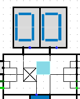
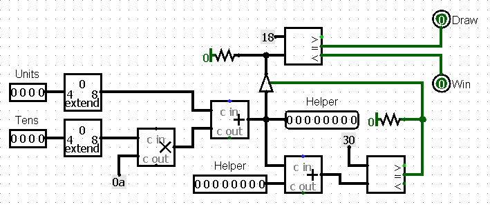

# mancala

> by Dmitry Vashurin, Klim Bagryantsev, Tulegenova Karina
> 17/05/2022

# Overview

The Mancala game is a two-player turn-based strategy board game played with small objects and rows of pits. The objective is usually to capture all or some amount of the opponent's pieces. Mancala has many variations, which differ from region to region. Our implementation refers to a version invented by William Julius Champion, USA.

# Rules of the game

**EXAMPLE OF A MANCALA GAME BOARD**

Our variation considers six small pits on each side and a big pit, called mancala, at each end. Each player controls the pits and their seeds on his side of the board. The object of the game is to get more seeds in your mancala than your opponent. At the beginning of the game, all pits have four seeds and players' mancalas are empty

**Turn**

- During the turn, the player removes all seeds from one of his pits. Moving counter-clockwise, the player drops one seed in each pit next to initial, including the player's mancala but not opponent's one

**Capture**

- If the last seed lands in an empty player's pit and the opposite pit contains seeds, both the last seed and the opposite seeds goes to player's mancala

**Extra move**

- If the last seed lands in the player's mancala, the player gets an extra move. There is no limit on the moves a player can make in their turn.

When one player no longer has any seeds in any of their houses, the game ends. The other player moves all remaining seeds to their store, and the player with the most seeds in their store wins. The game may result in a draw.

# Game board circuits

[//]: # (Revise the link)

This circuit represents the structure of a game board implemented in [Logisim](http://cburch.com/logisim/). All other circuits, described further, are its sub circuits by default.

Our game board implies that the human player is playing against the AI. Buttons below displays are designed to choose pits on player's side. Displays are designed to show the amount of seeds in a pit. All data is transmitted via the main bus.

### Bus structure

Bus maintains transmission between pits and processor

* `Data` - pit data
* `Position` - pit position
* `Address` - pit address
* `R/W selector` - processor R/W signal
* `Clock` - system clock signal

### LED signals

Upper LED lights in in the center of the board denote current game state

|         I/O port       |                    Desription                        |
| :--------------------- | :--------------------------------------------------- |
| **Calculating machine**|AI player's move processing                           |
| **Machine thinks**     |AI calculates next move                               |
| **Game starts**        |Filling pits with seeds                               |
| **Checking rules**     |Processing next move according to rules               |
| **Awaiting user**      |Waiting for a player to make a move                   |
| **Calculating user**   |Player's move processing                              |

Lower LED lights in the center are designed to mark the winner in a more obvious way

## Button driver

Proccesses button trigger signals and transmits signals to button register

  
**BUTTON DRIVER CIRCUIT**

  
**BUTTON DRIVER ON GAME PAD**

* `Position` - pit position from [`Button register`](#Button-register)
* `IO Address` - lower 4 bits of processor address bus, generated by `Address decoder`
* `Button`- signal from `Button trigger`
* `Is zero` - checks the pit is non-zero
* `Trigger` - asserts signal `Button trigger` for latching position

If the button is pushed, driver transmits current position. Otherwise, it transmits the input from the previous button driver or the default value

## Button register

Stores pit data and transmits IO data and addresses for processor

  
**BUTTON REGISTER CIRCUIT**

  
**BUTTON REGISTER ON GAME BOARD**

Combined display driver and button register. Stores pit data

* `Data` - pit data from main bus
* `Dataout` - pit data passed to main bus
* `Position IO` - position of a pit
* `Address IO` - lower 4 bits of processor address bus, generated by `Address decoder`
* `RW selector` - read/write mode
* `Driver` - passes pit position to [`Button driver`](#Button-driver)
* `Tens/Units` - pit data

When the position is equal to address, while the selector is in Write mode, given data gets stored in Tens/Units of the current register. Otherwise, if the selector is in Read mode register data from Tens/Units passes to the next button register

In other cases data transfers through current register onto the next one

## RAM & Gamepad address manager

Converts 8-digit processor address into a 4-digit address for Gamepad/ROM circuits

**GAMEPAD ADDRESS MANAGER CIRCUIT**

**GAM ON GAME BOARD**

**RAM ADDRESS MANAGER CIRCUIT**

**RAM ON GAME BOARD**

## WLD chip

Win-lose-draw chip establishes the outcome of the game

  
**WLD CHIP CIRCUIT**

  
**WLD CHIP ON GAME BOARD**

Gets the amount of seeds in player's mancala and asserts the winner of the game

It also checks whether the player's pits are empty or not

> It is obvious that more than a half of stones in one's mancala guarantees that the player has won

# Processing circuits

**PROCESSOR RELATED CIRCUITS**

In the executive part of our game we have 4 ROMs for game related instruction sets and data managment

## User input register

Stores the information about the last turn

  
**USER INPUT REGISTER CIRCUIT**

  
**USER INPUT REGISTER IN CIRCUITRY**

* `User input` - gets an address from `Button driver` or the default value
* `Program IO` - a command or an address generated by processor
* `Address` - input from `Address Bus`
* `RW selector` - read/write mode
* `Data` - data/command flag

## Big controlled buffer

Prohibits processor to access ROMs if the game is not currently working with instructions

  
**BIG CONTROLLED BUFFER CIRCUIT**

  
**BIG CONTROLLED BUFFER IN CIRCUITRY**

## ROM manager

Stores information into ROM switching register and transmit signal to a certain ROM bank

  
**ROM MANAGER CIRCUIT**

  
**ROM MANAGER IN CIRCUITRY**

* `Data` - data generated by `Data Bus`
* `Address` - address generated by processor
* `Control Byte` - `f0` constant

If the processor is currently reading from ROM switching register then the manager stores new value into a register and uses a decoder to transmit the position of a ROM bank

# Data structure

This section is for explanations for data structure 

## Memory planning

`00-DF` - 
`E0-EF` - RAM block  
`E0-EF` - RAM block  
`F0` - ROM swithcing register  
`F1-F7` - user's pits & mancala  
`F8` - User input register  
`F9-FF` - AI's pits & mancala  

> In fact, except for the RAM block, every other register is located around the main circuit in proper sub circuits

* `RAM block` - contains miscellaneous information for calculations (i.e. the pit, which was the last in a sowing process)
* `ROM switching register` is suited for "jumper" template, which switches different ROM blocks
* `User input register` stores information about a player, who the last to make a turn

## ROM banks

#### INITIALIZATION BANK

Initializes the values in the players' pits and switches to a Human ROM bank to let the player make his first move.

#### REFEREE BANK

Executes the capture rule and the extra move rule. Judges who will be the next to make a turn and switches to a proper player's bank. Checks whether all pits are empty or not.

#### HUMAN BANK

Processes player's move: executes sowing, stores the data to RAM block and switches to the Referee Bank

#### COMPUTER BANK

One of the computer bank's tasks is to calculate the best move and because it is hard to implement some extraordinary AI in Assembly code our realization just checks whether it is possible to get an extra move or to capture opponent's seeds. Otherwise, it just makes any possible move.

The other part of the bank simply executes AI's turn according to the rules of the game the same way Human bank does.