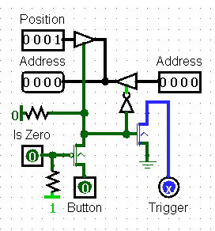
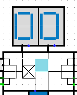
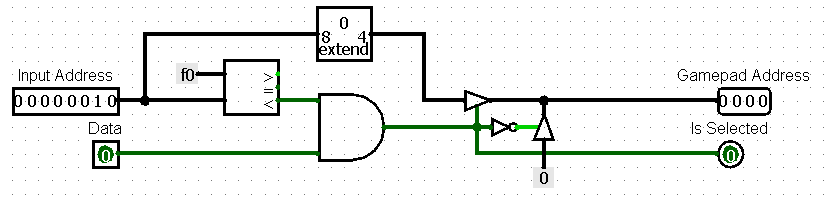
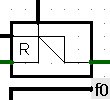
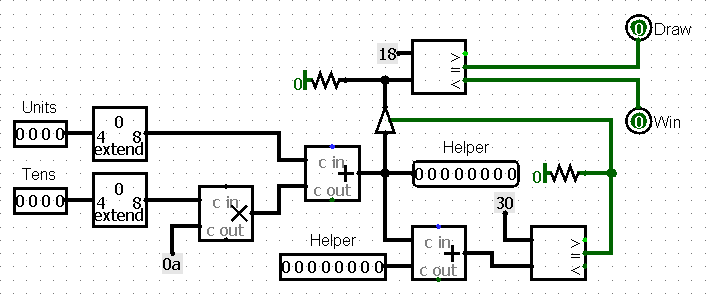
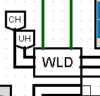

# mancala

> by Dmitry Vashurin, Klim Bagryantsev, Tulegenova Karina
>17/05/2022

# Overview

The Mancala game is a two-player turn-based strategy board game played with small objects and rows of pits. The objective is usually to capture all or some amount of the opponent's pieces. Mancala has many variations, which differ from region to region. Our implementation refers to a version invented by William Julius Champion, USA.

# Rules of the game

**EXAMPLE OF A MANCALA GAMEPAD**

Our variation considers six small pits on each side and a big pit, called mancala, at each end. Each player controls the pits and their seeds on his side of the board. The object of the game is to get more seeds to your mancala than your opponent. At the beginning of the game, allpits have four seeds and players' mancalas are empty.

**Turn**

- During the turn, the player removes all seeds from one of his pits. Moving counter-clockwise, the player drops one seed in each pit next to initial, including the player's mancala but not opponent's one

**Capture**

- If the last seed lands in an empty player's pit and the opposite pit contains seeds, both the last seed and the opposite seeds goes to player's mancala

**Extra move**

- If the last seed lands in the player's mancala, the player gets an extra move. There is no limit on the moves a player can make in their turn.

When one player no longer has any seeds in any of their houses, the game ends. The other player moves all remaining seeds to their store, and the player with the most seeds in their store wins. The game may result in a draw.

# Circuits description

## Game board

The above circuit represents the structure of a game board implemented in Logisim. All other circuits, described further, are its sub circuits by default.

### Bus structure

Bus is connected to button registers

* `Data` - pit data
* `Position` - pit position
* `Address` - pit address
* `R/W selector` - processor R/W signal
* `Clock` - system clock signal

### LED signals

Six LED lights in in the center of the board denote current game state

|         I/O port        |                    Desription                         |
| :---------------------: | :---------------------------------------------------: |
| **Calculating machine** | AI player's move processing                           |
| **Machine thinks**      | AI player calculates the best move (see Computer ROM) |
| **Game starts**         | Filling pits with seeds (see Initialization ROM)      |
| **Checking rules**      | see Referee ROM                                       |
| **Awaiting user**       | The game pauses till the player makes his move        |
| **Calculating user**    | Player's move processing                              |

## BUTTON DRIVER

  
**BUTTON DRIVER CIRCUIT**

  
**BUTTON DRIVER ON GAME PAD**

* `Position` - gets the position of a pit
* * `IO Address` - lower 4 bits of processor address bus, generated by `Address decoder`
* `Button`- signal from `Button trigger`
* `IO Select` - 
* `Is zero` - checks whether the pit has seeds or not
* `Trigger` - ***
>Address (I/O) - gets the address of the pit from the previous button driver and passes it to the next button driver

If the button is pushed, it makes all necessary checks and then decides whether to pass the address input from the previous button driver or to pass an address of pit, where the button was pushed

## BUTTON REGISTER & DISPLAY DRIVER

  
**BUTTON REGISTER CIRCUIT**

  
**BUTTON REGISTER ON GAME BOARD**

* `Data` - pit data from main bus
* `Dataout` - pit data passed to main bus
* `Position IO` - position of a pit
* `Address IO` - lower 4 bits of processor address bus, generated by [`Address decoder`](#address_decoder)
* `RW selector` - read/write mode
* `Driver` - passes pit position to [`Button driver`](#button_driver)
* `Tens/Units` - pit data

When the position is equal to address, while the selector is in Write mode, given data gets stored in Tens/Units of the current register. Otherwise, if the selector is in Read mode register data from Tens/Units passes to the next button register ending up in G.out

In other cases data transfers through current register onto the next one

---

## RAM & GAMEPAD ADDRESS MANAGER

**GAMEPAD ADDRESS MANAGER CIRCUIT**

**GAM ON GAME BOARD**

**RAM ADDRESS MANAGER CIRCUIT**

**RAM ON GAME BOARD**

Converts 8-digit input address into a 4-digit output address for Gamepad/ROM

---

## WIN-LOSE-DRAW CHIP

**WLD CHIP CIRCUIT**

**WLD CHIP ON GAME BOARD**

Gets the amount of seeds in player's mancala and judges on the amount of seeds who is the winner

!!! notice "It also checks whether the player's pits are empty or not."

> It is obvious that more than a half of stones in one's mancala guarantees that the player has won

# Data structure

This section is for explanations for data structure 

## Memory planning

`00-DF` - 
`E0-EF` - RAM block  
`E0-EF` - RAM block  
`F0` - ROM swithcing register  
`F1-F7` - user's pits & mancala  
`F8` - turn register  
`F9-FF` - AI's pits & mancala  

> In fact, except for the RAM block, every other register is located around the main circuit in proper sub circuits

* `RAM block` - contains data about the last move. I.e. the pit where the move ended up, whom of the players has made the last move and other miscellaneous information
* `ROM switching register` is suited for "jumper" template, which switches different ROM blocks
* `Turn register` stores information about player, who must make next move

## ROM banks

**INITIALIZATION BANK**

Initializes the values in the players' pits and switches to a Human ROM bank to let the player make his first move.

**REFEREE BANK**

Executes the capture rule and the extra move rule. Judges who will be the next to make a turn and switches to a proper player's bank. Checks whether all pits are empty or not.

**HUMAN BANK**

Processes player's move: executes sowing, stores the data to RAM block and switches to the Referee Bank

**COMPUTER BANK**

One of the computer bank's tasks is to calculate the best move and because it is hard to implement some extraordinary AI in Assembly code our realization just checks whether it is possible to get an extra move or to capture opponent's seeds. Otherwise, it just makes any possible move.

The other part of the bank simply executes AI's turn according to the rules of the game the same way Human bank does.

## PITS OPERATION SYSTEM

All necessary calculations are executed in ROM blocks, so that the game board is in fact consists of a bus for reading and writing necessary data into button registers and 7-segment displays to represent the pit's values. It allows us to simplify the circuit's structure.
